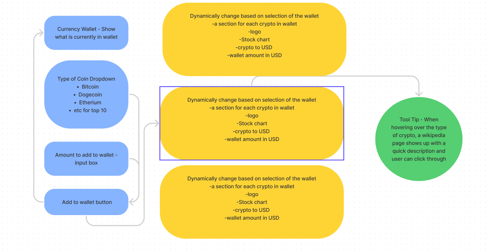

Project 1 Proposal - Group 4

Kathryn Neal
Troy Allen
Robert Augusta
Michael Fraser
Tyler Magoun

Cryptocurrency Wallet

Project Summary

The purpose of this application is to provide the user with a dashboard to view current crypto exchange rates as well as historical exchange rates. The user has a persistent virtual wallet that contains their coins and current exchange rate. The application will also provide the user a way to research more information on the various cryptocurrencies within the wallet through Wikipedia.

The user interacts with the left hand side of the screen. They select which type of currency they want to convert, the amount they wish to convert and are shown a running tally of how much they have in their wallet. Once the user selects the “Add to wallet” button, the right hand side of the screen will display the dynamic information about the type of currency based on the type of currency added to the wallet. As the user continues to add different types of currency, additional dynamic information will be displayed to the user so that when their wallet is refreshed, they can see at a glance how much they have in each type of currency, the current exchange rate, and how it is doing in the market.

If the user hovers over the name of the currency in the dynamic information box, a tooltip showing the Wikipedia summary is displayed to give the user more information. If they wish, they will be able to click through to the full Wikipedia article.

User Story

As a cryptocurrency holder, I want to view my wallet in different currencies, So that I can make informed trading decisions.
As a cryptocurrency holder, I want to research different cryptocurrencies, So that I can decide if there are better options to purchase.

List of APIs 

Coin Library: https://coinlib.io/apidocs

Coin Stock Chart: https://finnhub.io/ 

Wikipedia: https://www.mediawiki.org/wiki/API:Main_page

Bulma.io

Breakdown of Tasks

Front-end Design and Styling: Team
Javascript - Wallet: Kathryn
API Dynamic Card: Troy
Tooltip: Tyler

Wireframe and User Flow Diagram

Page Link: https://tsmagoun.github.io/UNH-Project-1/

